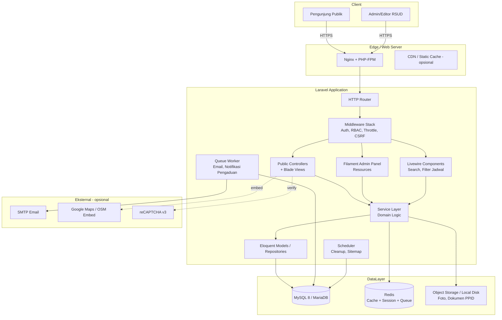
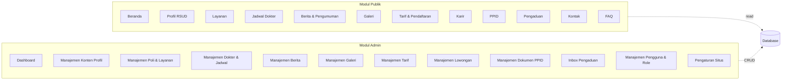
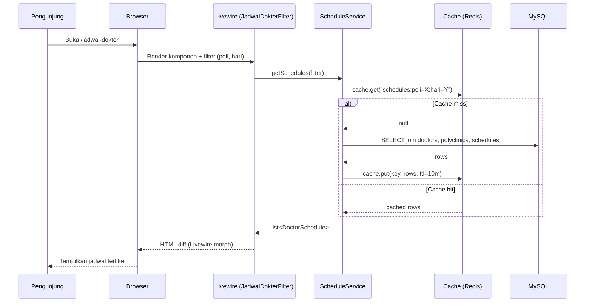
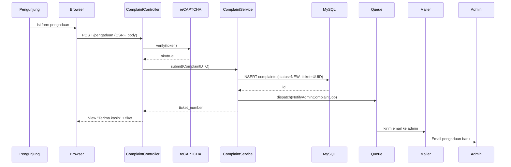
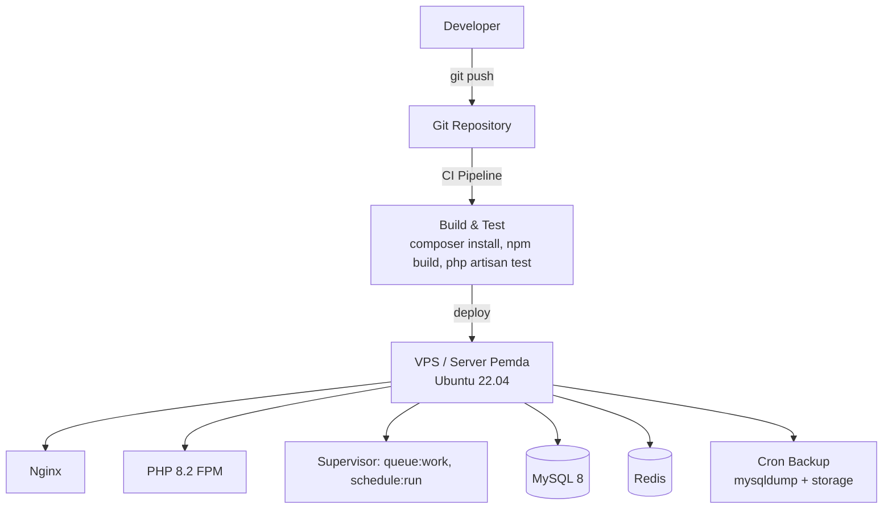

# Design Document: Website RSUD (Rumah Sakit Umum Daerah)

## Overview

Website RSUD adalah portal informasi publik resmi rumah sakit umum daerah yang menyajikan profil organisasi, layanan medis, jadwal dokter, berita/pengumuman, informasi tarif, alur pendaftaran, transparansi PPID, karir, pengaduan, dan kontak. Selain bagian publik (frontend), sistem juga menyediakan panel admin/CMS untuk pengelolaan konten dinamis (jadwal dokter, berita, dokter, poliklinik, layanan, galeri, lowongan, tarif, pengaduan, dll).

Pendekatan teknis menggunakan **Laravel 11** (PHP 8.2+) dengan arsitektur klasik server-side rendering berbasis **Blade templating**, ditingkatkan dengan **Livewire 3** untuk komponen dinamis (filter jadwal dokter, search berita, form pengaduan tanpa full reload). Database menggunakan **MySQL 8** (atau MariaDB 10.6+ kompatibel) yang umum tersedia di environment hosting pemerintah daerah. Pemilihan Laravel didasarkan pada: (1) ekosistem mature dengan banyak paket administrasi (Filament, Spatie Permission), (2) kemudahan maintenance jangka panjang oleh developer lokal, (3) dukungan komunitas Indonesia yang luas, (4) pola MVC yang sesuai dengan kebutuhan content-heavy website, dan (5) tooling bawaan (migration, seeder, queue, cache) yang lengkap untuk kebutuhan instansi pemerintah.

Untuk panel admin, digunakan **Filament 3** sebagai CMS layer karena menyediakan resource generator, form builder, table builder, dan RBAC out-of-the-box, memangkas waktu pengembangan modul CRUD secara signifikan dan menyediakan UX admin yang konsisten.

## Architecture

### High-Level Architecture



### Modul Fungsional



### Sequence Diagram: Pengunjung Mencari Jadwal Dokter



### Sequence Diagram: Submit Pengaduan Publik



### Deployment View



## Components and Interfaces

### Layered Structure (Laravel)

```
app/
├── Http/
│   ├── Controllers/
│   │   ├── Public/        # Controller halaman publik
│   │   └── Api/           # API endpoint (jika perlu)
│   ├── Middleware/
│   ├── Requests/          # FormRequest validation
│   └── Livewire/          # Komponen interaktif
├── Filament/
│   ├── Resources/         # Resource admin (CRUD)
│   ├── Pages/             # Halaman dashboard kustom
│   └── Widgets/           # Statistik
├── Models/                # Eloquent models
├── Services/              # Business logic
├── Repositories/          # Query abstraction (opsional)
├── Policies/              # Authorization
├── Jobs/                  # Queue jobs
├── Notifications/         # Email/DB notification
└── Support/               # Helper, enum, value object
```

### Komponen Inti

#### Component 1: PublicSiteController (Controllers Publik)

**Purpose**: Menyajikan halaman-halaman publik (Beranda, Profil, Layanan, dll) dengan data yang sudah dipersiapkan oleh service layer.

**Interface**:
```php
namespace App\Http\Controllers\Public;

interface PublicPageController
{
    public function index(): \Illuminate\View\View;
}

class HomeController implements PublicPageController { /* ... */ }
class ProfileController implements PublicPageController { /* sejarah, visi-misi, struktur, direktur */ }
class ServiceController implements PublicPageController { /* poliklinik, rawat inap, IGD, dll */ }
class DoctorScheduleController implements PublicPageController { /* daftar + filter */ }
class NewsController { /* index, show($slug), category($slug) */ }
class GalleryController { /* foto, video */ }
class TariffController { /* tarif & alur pendaftaran */ }
class CareerController { /* index, show($slug) */ }
class PpidController { /* dokumen informasi publik */ }
class ComplaintController { /* form, store */ }
class ContactController { /* halaman kontak + lokasi */ }
class FaqController { /* index */ }
```

**Responsibilities**:
- Menerima HTTP request, validasi parameter.
- Memanggil service yang relevan.
- Mengembalikan Blade view dengan ViewModel.
- Tidak mengandung query database langsung.

#### Component 2: Service Layer

**Purpose**: Menyimpan business logic dan orkestrasi antara repository, cache, dan eksternal.

**Interface**:
```php
namespace App\Services;

interface DoctorScheduleService
{
    public function listFiltered(ScheduleFilter $filter): \Illuminate\Support\Collection;
    public function findByDoctor(int $doctorId): \Illuminate\Support\Collection;
}

interface NewsService
{
    public function paginatePublished(int $perPage = 9, ?string $categorySlug = null): LengthAwarePaginator;
    public function findBySlug(string $slug): ?News;
    public function incrementViews(News $news): void;
}

interface ComplaintService
{
    public function submit(ComplaintData $data): Complaint;       // returns with ticket_number
    public function changeStatus(Complaint $c, ComplaintStatus $s, ?string $note): void;
}

interface SiteSettingService
{
    public function get(string $key, mixed $default = null): mixed;
    public function set(string $key, mixed $value): void;
    public function all(): array;                                 // cached
}
```

**Responsibilities**:
- Validasi domain (di luar form validation).
- Caching strategi (lihat Performance Considerations).
- Memanggil queue/notification.

#### Component 3: Livewire Components

**Purpose**: Interaksi dinamis tanpa SPA framework.

**Interface**:
```php
namespace App\Http\Livewire;

class DoctorScheduleFilter extends Component
{
    public ?int $polyclinicId = null;
    public ?string $day = null;       // SENIN..MINGGU
    public ?string $search = null;
    public function render(): View;
}

class NewsSearch extends Component
{
    public string $q = '';
    public ?string $category = null;
    public function render(): View;
}

class ComplaintForm extends Component
{
    // properties + rules() + submit()
}
```

#### Component 4: Filament Admin Resources

**Purpose**: Panel admin untuk mengelola entitas.

**Resources** (satu per entitas utama):
```
DoctorResource, PolyclinicResource, ScheduleResource,
NewsResource, NewsCategoryResource,
GalleryResource, MediaResource,
ServiceResource, TariffResource,
JobVacancyResource, PpidDocumentResource,
ComplaintResource, FaqResource,
HeroSlideResource,
SiteSettingPage, UserResource, RoleResource
```

**Responsibilities**:
- CRUD form & table.
- Authorization via Policy.
- Relasi (BelongsTo, HasMany) di-render otomatis.
- Audit log via spatie/laravel-activitylog.

#### Component 5: Hero Slider (Beranda) & Modern Header

**Purpose**: Menyajikan hero slider (carousel) yang dikelola admin di bagian paling atas beranda, serta header modern yang lebih informatif.

##### 5a. HeroSlideResource (Admin)

Filament Resource untuk mengelola `HeroSlide`:
- **CRUD** slide dengan upload gambar ke **public disk** (`FileUpload::make('image_path')->disk('public')->image()->maxSize(2048)->acceptedFileTypes(['image/jpeg','image/png','image/webp'])`).
- **Reorderable** berdasarkan `sort_order` (`->reorderable('sort_order')` pada table) sehingga admin dapat drag-and-drop urutan slide.
- **Toggle `is_active`** sebagai kolom & field form (default true).
- **Paired CTA validation**: `cta_label` dan `cta_url` saling `requiredWith`; `cta_url` divalidasi `url()`.
- **Policy-guarded** oleh permission `slider.*` (`slider.viewAny`, `slider.create`, `slider.update`, `slider.delete`) — selaras Requirement 36.5/36.6.
- **Audit log**: setiap mutasi tercatat via `spatie/laravel-activitylog` (Requirement 36.7).
- **Cache invalidation**: pada event `saved`/`deleted`/reorder, model/resource memicu invalidasi cache beranda (Requirement 36.4 / 1.6).

```php
// app/Filament/Resources/HeroSlideResource.php (sketsa)
class HeroSlideResource extends Resource
{
    protected static ?string $model = HeroSlide::class;

    public static function form(Form $form): Form
    {
        return $form->schema([
            FileUpload::make('image_path')->image()->disk('public')
                ->directory('hero')->maxSize(2048)
                ->acceptedFileTypes(['image/jpeg','image/png','image/webp'])
                ->required(fn (string $context) => $context === 'create'),
            TextInput::make('headline')->maxLength(150),
            TextInput::make('subheadline')->maxLength(255),
            TextInput::make('cta_label')->maxLength(60)
                ->requiredWith('cta_url'),
            TextInput::make('cta_url')->url()->maxLength(255)
                ->requiredWith('cta_label'),
            TextInput::make('sort_order')->integer()->default(0)->minValue(0),
            Toggle::make('is_active')->default(true),
        ]);
    }

    public static function table(Table $table): Table
    {
        return $table
            ->defaultSort('sort_order')
            ->reorderable('sort_order')
            ->columns([
                ImageColumn::make('image_path')->disk('public'),
                TextColumn::make('headline')->limit(40)->searchable(),
                IconColumn::make('is_active')->boolean(),
                TextColumn::make('sort_order')->sortable(),
            ]);
    }
}
```

##### 5b. HeroSlide Eloquent Model

```php
// app/Models/HeroSlide.php (sketsa)
class HeroSlide extends Model
{
    use LogsActivity; // spatie/laravel-activitylog (Req 36.7)

    protected $fillable = [
        'image_path','headline','subheadline',
        'cta_label','cta_url','sort_order','is_active',
    ];
    protected $casts = ['is_active' => 'bool', 'sort_order' => 'int'];

    // Hanya slide aktif, terurut sort_order asc (Req 35.2)
    public function scopeActive(Builder $q): Builder
    {
        return $q->where('is_active', true)->orderBy('sort_order');
    }

    public function getActivitylogOptions(): LogOptions
    {
        return LogOptions::defaults()->logFillable();
    }
}
```

##### 5c. HomeController & Header

- `HomeController::index` kini memuat **active hero slides** (`HeroSlide::active()->get()`) dan meneruskannya ke view beranda. Jika koleksi kosong, controller menyiapkan **hero fallback** dari `SiteSetting` (`hero_default_*`) sehingga area hero tidak pernah kosong (Req 35.4).
- Hero dirender lewat **Blade partial** (`resources/views/public/partials/hero.blade.php`) menggunakan **Swiper** untuk carousel: auto-play, kontrol next/prev, dot indicator, pause on hover/focus, navigasi keyboard panah, dan swipe pada perangkat sentuh (Req 35.5–35.8).
- **Header modern** (`partials/header.blade.php`):
  - **Top bar**: nomor telepon, jam layanan, dan kontak IGD/gawat darurat — nilainya dari `SiteSetting` (Req 1.8).
  - **Main nav** dengan **active-state** berdasarkan rute aktif (`request()->routeIs(...)`) (Req 1.7).
  - **Responsive toggle** memakai **Alpine** (`x-data`/`x-show`) untuk menu buka-tutup tanpa reload pada lebar layar `<768px` (Req 1.9).

```php
// app/Http/Controllers/Public/HomeController.php (sketsa)
public function index(SiteSettingService $settings): View
{
    $payload = Cache::remember('home:payload', now()->addMinutes(10), function () use ($settings) {
        $slides = HeroSlide::active()->get();
        return [
            'heroSlides'  => $slides,
            'heroFallback'=> $slides->isEmpty() ? $settings->heroDefault() : null,
            'featured'    => /* layanan unggulan */,
            'todaySchedule' => /* jadwal hari ini */,
            'latestNews'  => /* maksimal 6 berita PUBLISHED */,
        ];
    });

    return view('public.home', $payload);
}
```

```blade
{{-- resources/views/public/partials/hero.blade.php (sketsa Swiper) --}}
@if($heroSlides->isNotEmpty())
<div class="swiper hero-swiper" tabindex="0">
  <div class="swiper-wrapper">
    @foreach($heroSlides as $i => $slide)
      <div class="swiper-slide relative">
        url($slide->image_path) }}"
             alt="{{ $slide->headline }}"
             loading="{{ $i === 0 ? 'eager' : 'lazy' }}">{{-- Req 35.9 --}}
        <div class="absolute inset-0 bg-black/40">{{-- overlay kontras 4.5:1, Req 35.10 --}}
          @if($slide->headline)<h2>{{ $slide->headline }}</h2>@endif
          @if($slide->subheadline)<p>{{ $slide->subheadline }}</p>@endif
          @if($slide->cta_label && $slide->cta_url)
            <a href="{{ $slide->cta_url }}">{{ $slide->cta_label }}</a>
          @endif
        </div>
      </div>
    @endforeach
  </div>
  <div class="swiper-pagination"></div>
  <div class="swiper-button-prev"></div>
  <div class="swiper-button-next"></div>
</div>
@else
  {{-- hero fallback statis dari SiteSetting (Req 35.4) --}}
  @include('public.partials.hero-fallback', ['hero' => $heroFallback])
@endif
```

## Data Models

### Entity-Relationship Diagram

```mermaid
erDiagram
    USERS ||--o{ NEWS : "menulis"
    USERS }o--o{ ROLES : "punya"
    NEWS_CATEGORIES ||--o{ NEWS : "memuat"
    NEWS ||--o{ MEDIA : "punya"
    POLYCLINICS ||--o{ DOCTORS : "berisi"
    POLYCLINICS ||--o{ SERVICES : "menyediakan"
    DOCTORS ||--o{ DOCTOR_SCHEDULES : "punya"
    SERVICES ||--o{ TARIFFS : "punya"
    GALLERIES ||--o{ MEDIA : "berisi"
    JOB_VACANCIES }o--|| USERS : "diposting"
    PPID_DOCUMENTS }o--|| PPID_CATEGORIES : "tergolong"
    COMPLAINTS ||--o{ COMPLAINT_LOGS : "punya"
    PAGES ||--o{ MEDIA : "memuat"
    SITE_SETTINGS
    HERO_SLIDES

    USERS {
        bigint id PK
        string name
        string email UK
        string password
        timestamp email_verified_at
    }
    ROLES {
        bigint id PK
        string name UK
        string guard_name
    }
    NEWS_CATEGORIES {
        bigint id PK
        string name
        string slug UK
    }
    NEWS {
        bigint id PK
        bigint category_id FK
        bigint author_id FK
        string title
        string slug UK
        text excerpt
        longtext body
        string cover_image
        enum status "DRAFT|PUBLISHED|ARCHIVED"
        timestamp published_at
        int views
    }
    POLYCLINICS {
        bigint id PK
        string name
        string slug UK
        text description
        string icon
        boolean is_active
        int sort_order
    }
    DOCTORS {
        bigint id PK
        bigint polyclinic_id FK
        string name
        string slug UK
        string photo
        string specialization
        text bio
        boolean is_active
    }
    DOCTOR_SCHEDULES {
        bigint id PK
        bigint doctor_id FK
        bigint polyclinic_id FK
        enum day "SENIN..MINGGU"
        time start_time
        time end_time
        string note
        boolean is_active
    }
    SERVICES {
        bigint id PK
        bigint polyclinic_id FK_NULL
        string name
        string slug UK
        text description
        string icon
        enum type "POLI|RAWAT_INAP|IGD|PENUNJANG|UNGGULAN"
    }
    TARIFFS {
        bigint id PK
        bigint service_id FK
        string item_name
        decimal price
        string class
        text note
    }
    GALLERIES {
        bigint id PK
        string title
        string slug UK
        enum type "PHOTO|VIDEO"
        text description
    }
    MEDIA {
        bigint id PK
        string mediable_type
        bigint mediable_id
        string disk
        string path
        string mime
        int size
        string caption
        int sort_order
    }
    JOB_VACANCIES {
        bigint id PK
        string title
        string slug UK
        text description
        date open_at
        date close_at
        string attachment
        enum status "OPEN|CLOSED"
    }
    PPID_CATEGORIES {
        bigint id PK
        string name
        enum type "BERKALA|SERTA_MERTA|SETIAP_SAAT|DIKECUALIKAN"
    }
    PPID_DOCUMENTS {
        bigint id PK
        bigint category_id FK
        string title
        string file_path
        int year
        timestamp published_at
    }
    COMPLAINTS {
        bigint id PK
        string ticket_number UK
        string name
        string email
        string phone
        string subject
        text message
        enum status "NEW|IN_REVIEW|RESPONDED|CLOSED"
        string ip_address
    }
    COMPLAINT_LOGS {
        bigint id PK
        bigint complaint_id FK
        bigint user_id FK_NULL
        enum status
        text note
    }
    FAQS {
        bigint id PK
        string question
        text answer
        int sort_order
        boolean is_active
    }
    PAGES {
        bigint id PK
        string slug UK "sejarah, visi-misi, struktur, sambutan, dll"
        string title
        longtext body
    }
    SITE_SETTINGS {
        string key PK
        json value
    }
    HERO_SLIDES {
        bigint id PK
        string image_path "path pada public disk"
        string headline "nullable, <=150"
        string subheadline "nullable, <=255"
        string cta_label "nullable, <=60"
        string cta_url "nullable, url"
        int sort_order "default 0"
        boolean is_active "default true"
        timestamp created_at
        timestamp updated_at
    }
```

### Validation Rules per Entity

**News**:
- `title`: required, string, max:200
- `slug`: required, alpha_dash, unique(news)
- `body`: required, min:50
- `status`: in(DRAFT, PUBLISHED, ARCHIVED)
- `published_at`: required jika status=PUBLISHED, harus <= now() saat dipublish
- `cover_image`: image, max:2MB, mimes(jpg,jpeg,png,webp)

**Doctor**:
- `name`: required, max:120
- `polyclinic_id`: required, exists(polyclinics,id)
- `specialization`: required, max:120
- `photo`: image, max:1MB

**DoctorSchedule**:
- `doctor_id`: required, exists(doctors)
- `day`: required, in(SENIN..MINGGU)
- `start_time`, `end_time`: required, format H:i
- Domain rule: `start_time < end_time`
- Domain rule: tidak boleh overlap untuk doctor + day yang sama

**Complaint**:
- `name`: required, min:3, max:120
- `email`: required, email
- `phone`: nullable, regex(/^[0-9+\-() ]{8,20}$/)
- `subject`: required, max:200
- `message`: required, min:20, max:5000
- `g-recaptcha-response`: required, recaptcha (v3 score >= 0.5)
- Rate limit: 3/jam per IP

**Tariff**:
- `service_id`: required, exists(services)
- `item_name`: required, max:200
- `price`: required, numeric, min:0
- `class`: nullable, in(VIP, KELAS_1, KELAS_2, KELAS_3, EKSEKUTIF, UMUM)

**JobVacancy**:
- `open_at <= close_at`
- `status` auto-derive: if today > close_at maka CLOSED

**HeroSlide**:
- `image` (saat create): required, image, mimes(jpg,jpeg,png,webp), max:2MB → disimpan sebagai `image_path` pada public disk
- `image` (saat update): nullable (boleh tetap memakai gambar lama), aturan mime/ukuran sama bila diunggah ulang
- `headline`: nullable, string, max:150
- `subheadline`: nullable, string, max:255
- `cta_label`: nullable, string, max:60
- `cta_url`: nullable, url, max:255
- Domain rule (paired CTA): `cta_label` dan `cta_url` harus terisi berpasangan — keduanya terisi atau keduanya kosong (`required_with` dua arah).
- `sort_order`: required, integer, min:0 (default 0)
- `is_active`: required, boolean (default true)

> **Catatan desain**: `HeroSlide` sengaja dibuat sebagai tabel mandiri (`hero_slides`), bukan memanfaatkan tabel `media` polymorphic. Alasannya setiap slide membawa field teks/CTA terstruktur sendiri (`headline`, `subheadline`, `cta_label`, `cta_url`) di samping `sort_order` dan `is_active`, sehingga tidak cocok dengan model `media` yang generik (hanya `path`, `caption`, `sort_order`).

## Algorithmic Pseudocode

### Algoritma 1: Filter Jadwal Dokter

```pascal
ALGORITHM listFilteredSchedules(filter)
INPUT: filter = { polyclinicId?: int, day?: string, search?: string }
OUTPUT: List<DoctorScheduleVM> (view model untuk Blade)

BEGIN
  ASSERT filter.day IS NULL OR filter.day IN {SENIN..MINGGU}
  ASSERT filter.polyclinicId IS NULL OR filter.polyclinicId > 0

  cacheKey ← "schedules:" + hash(filter)
  cached  ← Cache.get(cacheKey)
  IF cached IS NOT NULL THEN
    RETURN cached
  END IF

  query ← DoctorSchedule.query()
            .join(doctors).join(polyclinics)
            .where(schedules.is_active = true)
            .where(doctors.is_active   = true)

  IF filter.polyclinicId IS NOT NULL THEN
    query.where(doctors.polyclinic_id = filter.polyclinicId)
  END IF

  IF filter.day IS NOT NULL THEN
    query.where(schedules.day = filter.day)
  END IF

  IF filter.search IS NOT NULL AND length(filter.search) >= 2 THEN
    query.where(doctors.name LIKE "%search%"
             OR doctors.specialization LIKE "%search%")
  END IF

  rows ← query.orderBy(polyclinics.name)
              .orderBy(schedules.day_index)   // SENIN=1..MINGGU=7
              .orderBy(schedules.start_time)
              .get()

  result ← rows.map(toViewModel)

  Cache.put(cacheKey, result, TTL = 10 minutes)
  RETURN result
END
```

**Preconditions**:
- `filter.day` jika diisi harus salah satu hari valid.
- `filter.polyclinicId` jika diisi harus integer positif (validasi di FormRequest).

**Postconditions**:
- Hasil hanya berisi schedule aktif dari dokter aktif.
- Hasil terurut: poli → hari → jam mulai.
- Cache di-set bila sebelumnya miss.

**Loop Invariants** (mapping):
- Setiap elemen pada `result` yang sudah dipetakan adalah view-model valid (memiliki dokter, poli, hari, jam mulai dan akhir).

### Algoritma 2: Validasi Bentrok Jadwal Dokter (Admin)

```pascal
ALGORITHM checkScheduleOverlap(doctorId, day, start, end, excludeId?)
INPUT: doctorId, day, start, end (Time), excludeId opsional
OUTPUT: boolean (true = bentrok)

BEGIN
  ASSERT start < end

  candidates ← DoctorSchedule
    .where(doctor_id = doctorId)
    .where(day = day)
    .where(is_active = true)
    .when(excludeId IS NOT NULL, q → q.where(id ≠ excludeId))
    .get()

  FOR each s IN candidates DO
    // Bentrok jika [start,end) ∩ [s.start,s.end) ≠ ∅
    IF (start < s.end_time) AND (end > s.start_time) THEN
      RETURN true
    END IF
  END FOR

  RETURN false
END
```

**Preconditions**: `start < end`, `day ∈ {SENIN..MINGGU}`.
**Postconditions**: Mengembalikan `true` jika dan hanya jika ada interval overlap.
**Loop Invariant**: Semua elemen `candidates` yang sudah diperiksa terbukti tidak overlap dengan `[start,end)`.

### Algoritma 3: Submit Pengaduan

```pascal
ALGORITHM submitComplaint(dto, ip)
INPUT: dto (ComplaintData), ip (string)
OUTPUT: Complaint (dengan ticket_number)

BEGIN
  ASSERT dto.name ≠ "" AND isEmail(dto.email)
  ASSERT length(dto.message) BETWEEN 20 AND 5000

  // Rate limit
  IF RateLimiter.tooMany("complaint:" + ip, 3, "1h") THEN
    THROW TooManyAttemptsException
  END IF

  // reCAPTCHA verifikasi sudah dilakukan di middleware
  ticket ← "RSUD-" + datePart(now()) + "-" + randomBase36(6)
  WHILE Complaint.exists(ticket_number = ticket) DO
    ticket ← "RSUD-" + datePart(now()) + "-" + randomBase36(6)
  END WHILE

  complaint ← Complaint.create({
    ticket_number: ticket,
    name: dto.name, email: dto.email, phone: dto.phone,
    subject: dto.subject, message: sanitize(dto.message),
    status: "NEW", ip_address: ip
  })

  ComplaintLog.create({
    complaint_id: complaint.id,
    status: "NEW",
    note: "Pengaduan masuk"
  })

  RateLimiter.hit("complaint:" + ip)
  Queue.dispatch(NotifyAdminComplaintJob(complaint.id))

  RETURN complaint
END
```

**Preconditions**: Input lulus FormRequest validation; reCAPTCHA verified.
**Postconditions**:
- 1 row di `complaints` dengan `status = NEW` dan ticket unik.
- 1 row di `complaint_logs` (audit).
- Job notifikasi admin terkirim ke queue.
**Loop Invariant** (loop ticket): Hingga loop berhenti, `ticket` belum pernah ada di tabel.

### Algoritma 4: Publikasi Berita Terjadwal

```pascal
ALGORITHM publishScheduledNews()  // dijalankan via scheduler tiap menit
INPUT: -
OUTPUT: int (jumlah dipublish)

BEGIN
  candidates ← News
    .where(status = "DRAFT")
    .whereNotNull(published_at)
    .where(published_at ≤ now())
    .lockForUpdate()
    .get()

  count ← 0
  FOR each n IN candidates DO
    n.status ← "PUBLISHED"
    n.save()
    Cache.forget("news:home")
    Cache.forget("news:slug:" + n.slug)
    count ← count + 1
  END FOR

  RETURN count
END
```

**Preconditions**: Scheduler berjalan (cron `* * * * * php artisan schedule:run`).
**Postconditions**: Semua berita yang `published_at ≤ now()` dan masih DRAFT berubah menjadi PUBLISHED.
**Loop Invariant**: Setiap iterasi, semua berita yang sudah diproses memiliki status PUBLISHED.

### Algoritma 5: Generate Sitemap.xml

```pascal
ALGORITHM generateSitemap()
INPUT: -
OUTPUT: file public/sitemap.xml

BEGIN
  urls ← []
  urls.add(staticUrls)                     // /, /profil, /layanan, dst
  urls.addAll(News.published.map(toUrl))
  urls.addAll(Doctor.active.map(toUrl))
  urls.addAll(Polyclinic.active.map(toUrl))
  urls.addAll(JobVacancy.where(status="OPEN").map(toUrl))

  xml ← buildXml(urls)
  Storage.put("public/sitemap.xml", xml)
  RETURN
END
```

## Key Functions with Formal Specifications

### Function 1: `DoctorScheduleService::listFiltered`

```php
public function listFiltered(ScheduleFilter $filter): Collection;
```

**Preconditions**:
- `$filter` adalah instance `ScheduleFilter` (DTO immutable) yang nilainya sudah lulus FormRequest.
- Koneksi DB dan Redis tersedia.

**Postconditions**:
- Mengembalikan `Collection<DoctorScheduleVM>` yang terurut deterministik (poli, day_index, start_time).
- Hanya berisi data aktif (schedule.is_active=true, doctor.is_active=true).
- Cache key konsisten untuk filter yang sama (idempotent terhadap struktur).

**Loop Invariants**: Selama mapping ke view-model, setiap elemen yang sudah ditambahkan ke hasil memiliki referensi dokter dan poli non-null.

### Function 2: `ScheduleService::checkOverlap`

```php
public function checkOverlap(int $doctorId, Day $day, string $start, string $end, ?int $excludeId = null): bool;
```

**Preconditions**:
- `$start`, `$end` format `H:i` valid; `$start < $end`.
- `$day` adalah enum `Day`.

**Postconditions**:
- `true` ⟺ ada minimal satu schedule aktif untuk dokter & hari yang sama yang interval-nya berpotongan.
- Tidak memodifikasi state.

### Function 3: `ComplaintService::submit`

```php
public function submit(ComplaintData $data, string $ip): Complaint;
```

**Preconditions**: Lihat algoritma 3.
**Postconditions**:
- Mengembalikan `Complaint` dengan `ticket_number` unik.
- Side effect: insert ke `complaints`, `complaint_logs`, dispatch job notifikasi.
- Throws `TooManyAttemptsException` jika melewati rate limit.

### Function 4: `NewsService::paginatePublished`

```php
public function paginatePublished(int $perPage = 9, ?string $categorySlug = null): LengthAwarePaginator;
```

**Preconditions**: `$perPage ∈ [1, 50]`.
**Postconditions**: Hanya berisi berita `status=PUBLISHED` dan `published_at ≤ now()`, terurut `published_at DESC`.

### Function 5: `SiteSettingService::get`

```php
public function get(string $key, mixed $default = null): mixed;
```

**Preconditions**: `$key` non-empty string.
**Postconditions**: Mengembalikan nilai dari cache `site_settings` (loaded once per request) atau `$default`. Tidak melakukan query ulang dalam request yang sama.

## Routing Layout

```php
// routes/web.php (publik)
Route::get('/',                       [HomeController::class, 'index'])->name('home');

Route::prefix('profil')->group(function () {
    Route::get('/sejarah',            [ProfileController::class, 'history'])->name('profil.sejarah');
    Route::get('/visi-misi',          [ProfileController::class, 'visionMission'])->name('profil.visi-misi');
    Route::get('/struktur-organisasi',[ProfileController::class, 'structure'])->name('profil.struktur');
    Route::get('/sambutan-direktur',  [ProfileController::class, 'directorMessage'])->name('profil.direktur');
});

Route::prefix('layanan')->group(function () {
    Route::get('/',                   [ServiceController::class, 'index'])->name('layanan.index');
    Route::get('/{slug}',             [ServiceController::class, 'show'])->name('layanan.show');
});

Route::get('/jadwal-dokter',          [DoctorScheduleController::class, 'index'])->name('jadwal');
Route::get('/dokter/{slug}',          [DoctorScheduleController::class, 'show'])->name('dokter.show');

Route::prefix('berita')->group(function () {
    Route::get('/',                   [NewsController::class, 'index'])->name('berita.index');
    Route::get('/kategori/{slug}',    [NewsController::class, 'category'])->name('berita.kategori');
    Route::get('/{slug}',             [NewsController::class, 'show'])->name('berita.show');
});

Route::get('/galeri',                 [GalleryController::class, 'index'])->name('galeri');
Route::get('/tarif',                  [TariffController::class, 'index'])->name('tarif');
Route::get('/pendaftaran',            [TariffController::class, 'registration'])->name('pendaftaran');

Route::prefix('karir')->group(function () {
    Route::get('/',                   [CareerController::class, 'index'])->name('karir.index');
    Route::get('/{slug}',             [CareerController::class, 'show'])->name('karir.show');
});

Route::prefix('ppid')->group(function () {
    Route::get('/',                   [PpidController::class, 'index'])->name('ppid.index');
    Route::get('/{type}',             [PpidController::class, 'byType'])->name('ppid.type');
});

Route::get('/pengaduan',              [ComplaintController::class, 'create'])->name('pengaduan.create');
Route::post('/pengaduan',             [ComplaintController::class, 'store'])
        ->middleware(['throttle:5,60','recaptcha'])
        ->name('pengaduan.store');
Route::get('/pengaduan/cek/{ticket}', [ComplaintController::class, 'track'])->name('pengaduan.track');

Route::get('/kontak',                 [ContactController::class, 'index'])->name('kontak');
Route::get('/faq',                    [FaqController::class, 'index'])->name('faq');

// Admin panel by Filament: /admin (auto routed)
```

## Example Usage

### Controller Publik

```php
// app/Http/Controllers/Public/DoctorScheduleController.php
class DoctorScheduleController extends Controller
{
    public function __construct(
        private readonly DoctorScheduleService $service,
        private readonly PolyclinicRepository $polyclinics,
    ) {}

    public function index(ScheduleIndexRequest $request): View
    {
        $filter = ScheduleFilter::fromRequest($request->validated());
        $schedules   = $this->service->listFiltered($filter);
        $polyclinics = $this->polyclinics->activeOrdered();

        return view('public.schedule.index', [
            'schedules'   => $schedules,
            'polyclinics' => $polyclinics,
            'filter'      => $filter,
            'days'        => Day::cases(),
        ]);
    }
}
```

### FormRequest

```php
// app/Http/Requests/ScheduleIndexRequest.php
class ScheduleIndexRequest extends FormRequest
{
    public function rules(): array
    {
        return [
            'polyclinic_id' => ['nullable','integer','exists:polyclinics,id'],
            'day'           => ['nullable','string', new Enum(Day::class)],
            'q'             => ['nullable','string','min:2','max:60'],
        ];
    }
}
```

### Service Implementation (sketsa)

```php
// app/Services/DoctorScheduleService.php
final class DoctorScheduleService
{
    public function __construct(
        private readonly Repository $cache,
        private readonly DoctorScheduleRepository $repo,
    ) {}

    public function listFiltered(ScheduleFilter $filter): Collection
    {
        $key = 'schedules:'.md5(serialize($filter->toArray()));

        return $this->cache->remember($key, now()->addMinutes(10),
            fn () => $this->repo->queryActive($filter)
                                ->get()
                                ->map(fn ($r) => DoctorScheduleVM::fromModel($r))
        );
    }
}
```

### Eloquent Model Example

```php
// app/Models/DoctorSchedule.php
class DoctorSchedule extends Model
{
    protected $fillable = ['doctor_id','polyclinic_id','day','start_time','end_time','note','is_active'];
    protected $casts    = ['day' => Day::class, 'is_active' => 'bool'];

    public function doctor(): BelongsTo      { return $this->belongsTo(Doctor::class); }
    public function polyclinic(): BelongsTo  { return $this->belongsTo(Polyclinic::class); }

    public function scopeActive(Builder $q): Builder
    {
        return $q->where('is_active', true)
                 ->whereHas('doctor', fn ($d) => $d->where('is_active', true));
    }
}
```

### Livewire Component (filter)

```php
// app/Http/Livewire/DoctorScheduleFilter.php
class DoctorScheduleFilter extends Component
{
    public ?int $polyclinicId = null;
    public ?string $day = null;
    public string $q = '';

    public function updated(): void { $this->resetPage(); }

    public function render(DoctorScheduleService $svc): View
    {
        $filter = new ScheduleFilter($this->polyclinicId, $this->day, $this->q);
        return view('livewire.doctor-schedule-filter', [
            'schedules' => $svc->listFiltered($filter),
        ]);
    }
}
```

### Filament Resource (sketsa)

```php
// app/Filament/Resources/DoctorScheduleResource.php
class DoctorScheduleResource extends Resource
{
    protected static ?string $model = DoctorSchedule::class;

    public static function form(Form $form): Form
    {
        return $form->schema([
            Select::make('doctor_id')->relationship('doctor','name')->required(),
            Select::make('day')->options(Day::optionsId())->required(),
            TimePicker::make('start_time')->seconds(false)->required(),
            TimePicker::make('end_time')->seconds(false)->required()
                      ->after('start_time'),
            TextInput::make('note')->maxLength(120),
            Toggle::make('is_active')->default(true),
        ]);
    }

    public static function table(Table $table): Table
    {
        return $table->columns([
            TextColumn::make('doctor.name')->searchable(),
            TextColumn::make('doctor.polyclinic.name')->label('Poli'),
            TextColumn::make('day')->badge(),
            TextColumn::make('start_time'),
            TextColumn::make('end_time'),
            IconColumn::make('is_active')->boolean(),
        ])->filters([
            SelectFilter::make('day')->options(Day::optionsId()),
        ]);
    }
}
```

## Correctness Properties

Properti universal yang harus selalu benar (untuk dijadikan basis property-based test atau invariant check):

1. **P1 — Schedule Non-Overlap**:
   ∀ schedules `s1, s2` aktif untuk `doctor_id` dan `day` yang sama, `s1.id ≠ s2.id` ⟹ interval `[s1.start, s1.end) ∩ [s2.start, s2.end) = ∅`.

2. **P2 — Schedule Validity**:
   ∀ schedule `s`: `s.start_time < s.end_time`.

3. **P3 — Slug Uniqueness**:
   ∀ `News`, `Doctor`, `Polyclinic`, `Service`, `JobVacancy`, `Page`: kolom `slug` unik dan format `^[a-z0-9-]+$`.

4. **P4 — Published News Visibility**:
   ∀ `n ∈ News` yang muncul di halaman publik: `n.status = PUBLISHED ∧ n.published_at ≤ now()`.

5. **P5 — Complaint Ticket Uniqueness & Format**:
   ∀ `c ∈ Complaints`: `c.ticket_number` unik dan match `^RSUD-\d{8}-[0-9A-Z]{6}$`.

6. **P6 — Tariff Non-Negative**:
   ∀ `t ∈ Tariffs`: `t.price ≥ 0`.

7. **P7 — Vacancy Date Order**:
   ∀ `v ∈ JobVacancies`: `v.open_at ≤ v.close_at`.

8. **P8 — RBAC Authorization**:
   ∀ aksi mutasi pada Filament: user yang melakukannya memiliki permission yang sesuai (lihat Security Considerations).

9. **P9 — Cache Coherence**:
   Setelah create/update/delete pada entitas X, cache key terkait X di-invalidate sebelum response dikirim.

10. **P10 — Idempotency Listing**:
    Pemanggilan `DoctorScheduleService::listFiltered($f)` dua kali berturut-turut dengan filter sama menghasilkan urutan & isi yang identik (di luar invalidasi cache).

11. **P11 — Rate Limit Pengaduan**:
    Tidak boleh ada > 3 `Complaint` dengan `ip_address` sama dalam window 1 jam.

12. **P12 — Soft Delete Consistency** (jika digunakan):
    Halaman publik tidak menampilkan baris yang `deleted_at ≠ null`.

13. **P13 — Hero Slide Visibility & Ordering**:
    ∀ koleksi hero slide yang dirender di beranda: setiap slide `s` memenuhi `s.is_active = true`, dan koleksi terurut menaik berdasarkan `sort_order` (∀ posisi `i < j` ⟹ `slides[i].sort_order ≤ slides[j].sort_order`). Jika tidak ada slide aktif (`count = 0`), area hero menampilkan fallback statis dari `SiteSetting` (tidak pernah kosong).
    *Validates: Requirement 35.2, 35.4*

14. **P14 — Hero Slide Paired CTA Invariant**:
    ∀ `s ∈ HeroSlides`: `(s.cta_label ≠ ∅ ∧ s.cta_url ≠ ∅) ∨ (s.cta_label = ∅ ∧ s.cta_url = ∅)` — `cta_label` dan `cta_url` selalu terisi berpasangan atau keduanya kosong; bila terisi, `s.cta_url` adalah URL valid.
    *Validates: Requirement 35.3, 36.3*

## Error Handling

### Skenario 1: Halaman / Slug Tidak Ditemukan
**Condition**: `News::findBySlug` mengembalikan null, atau Route Model Binding gagal.
**Response**: HTTP 404, render `errors.404` (Blade) dengan branding RSUD dan tombol kembali ke beranda.
**Recovery**: Logging level info; tidak ada efek samping.

### Skenario 2: Database Down
**Condition**: `QueryException` saat query inti (misal jadwal dokter).
**Response**: HTTP 503 dengan halaman maintenance ramah pengguna; admin diberi tahu via Sentry/log channel `daily`.
**Recovery**: Health check endpoint `/up` dipantau; reconnect otomatis oleh PDO.

### Skenario 3: Form Validation Gagal
**Condition**: FormRequest mengembalikan error.
**Response**: Redirect back dengan `withErrors` dan `withInput`; Livewire menampilkan inline error.
**Recovery**: User memperbaiki input.

### Skenario 4: Upload File Gagal / Terlalu Besar
**Condition**: File melebihi `post_max_size` atau gagal divalidasi.
**Response**: 422 dengan pesan jelas (ukuran/MIME tidak valid).
**Recovery**: User mengecilkan file atau ganti format.

### Skenario 5: reCAPTCHA Gagal
**Condition**: Skor < 0.5 atau token invalid.
**Response**: Tolak submit, pesan "Verifikasi gagal, silakan coba lagi."
**Recovery**: User menyegarkan dan mencoba kembali.

### Skenario 6: Rate Limit Pengaduan Terlampaui
**Condition**: > 3 submit per IP/jam.
**Response**: HTTP 429 + pesan ramah ber-bahasa Indonesia + waktu retry-after.
**Recovery**: Tunggu sampai window reset.

### Skenario 7: Schedule Overlap saat Admin Menyimpan
**Condition**: `checkOverlap` true.
**Response**: Validation error pada field `start_time`/`end_time`.
**Recovery**: Admin menyesuaikan jam.

### Skenario 8: Pengiriman Email Notifikasi Gagal
**Condition**: SMTP error pada job `NotifyAdminComplaintJob`.
**Response**: Job otomatis retry (3x dengan exponential backoff) lewat queue Redis; setelah gagal final masuk `failed_jobs`.
**Recovery**: Admin memeriksa `failed_jobs` dan re-dispatch via `php artisan queue:retry`.

## Testing Strategy

### Unit Testing
- Service layer (`DoctorScheduleService`, `ComplaintService`, `NewsService`, `SiteSettingService`) dengan repository di-mock.
- Helper, enum, value object (mis. `ScheduleFilter`, `Day::optionsId()`).
- Coverage target: ≥ 80% di `app/Services` dan `app/Support`.

### Feature Testing (HTTP)
- Setiap rute publik mengembalikan 200 dan view yang benar.
- Filter jadwal dokter mengembalikan subset yang konsisten.
- Submit pengaduan menghasilkan tiket dan menyimpan ke DB.
- Rate limit pengaduan: request ke-4 dalam 1 jam mendapat 429.
- Filament admin: hanya user dengan role yang sesuai bisa CRUD (Policy test).

### Property-Based Testing
**Library**: [Eris](https://github.com/giorgiosironi/eris) untuk PHP / Pest plugin untuk PBT.

Properti yang diuji (lihat Correctness Properties):
- P1, P2: Generate random schedules untuk satu dokter; pastikan saver menolak overlap dan menerima non-overlap.
- P5: Generate banyak Complaint, pastikan ticket unik dan format match regex.
- P10: Acak filter, pastikan dua pemanggilan berurutan menghasilkan koleksi identik.
- P6, P7: Acak Tariff/JobVacancy untuk validasi domain.

### Integration Testing
- DB integration test menggunakan in-memory MySQL/SQLite (atau MySQL via Docker) dan migration penuh.
- Redis cache invalidation test (memastikan setelah update jadwal, cache key dihapus).

### Browser Testing (opsional)
- Laravel Dusk untuk smoke test alur kunci: home → jadwal dokter (filter) → detail dokter, home → berita → detail.

## Performance Considerations

- **Caching**:
  - `cache.remember` 10 menit untuk: jadwal dokter (per filter), berita home, daftar dokter aktif per poli.
  - **Hero slides** dimuat sebagai bagian dari **cache payload beranda** (`home:payload`); cache ini di-invalidate saat ada mutasi `HeroSlide` (create/update/reorder/aktif-nonaktif/hapus) sebelum response berikutnya disajikan (Req 1.6 / 36.4), sejalan dengan invalidasi pada perubahan berita, jadwal, dan layanan unggulan.
  - `site_settings` dimuat sekali per request via `forever` cache, di-invalidate saat update.
  - HTTP cache header `Cache-Control: public, max-age=300` untuk halaman publik tanpa state user.
- **Eager Loading**: Hindari N+1 dengan `with(['polyclinic','schedules'])` di repository.
- **Hero LCP**: Gambar Hero_Slide pertama dirender dengan `loading="eager"` (kandidat LCP), sisanya `loading="lazy"` untuk menekan beban awal (Req 35.9 / 29.3).
- **Database Index**:
  - `news(status, published_at)`, `news(category_id, published_at)`
  - `doctor_schedules(doctor_id, day, is_active)`
  - `doctors(polyclinic_id, is_active)`
  - Unique index pada semua kolom `slug` dan `complaints.ticket_number`.
- **Image Optimization**: `intervention/image` untuk resize otomatis (thumbnail 400px, cover 1200px); format WebP fallback.
- **Pagination** semua listing (berita 9, dokter 12, lowongan 10).
- **Queue** untuk task non-blocking (email, generate sitemap, image processing).
- **Asset Build**: Vite dengan code splitting; lazy load gambar (`loading="lazy"`).
- **Target**: TTFB < 300ms (cache hit), LCP < 2.5s pada koneksi 4G.

## Security Considerations

- **Auth**: Laravel Breeze atau Filament built-in auth untuk admin; admin panel di `/admin` dengan rate limit login (5/min) dan `session` driver Redis.
- **RBAC**: `spatie/laravel-permission` dengan role: `super-admin`, `admin`, `editor`, `humas`, `petugas-pengaduan`, `viewer`. Permission per-resource (`news.create`, `news.publish`, `complaint.respond`, `slider.create`, `slider.update`, `slider.delete`, dst.).
- **CSRF**: Default Laravel pada semua state-changing form.
- **XSS**: Blade auto-escape (`{{ }}`); konten kaya berita melewati sanitizer (HTMLPurifier) sebelum disimpan.
- **SQL Injection**: Hanya menggunakan Query Builder/Eloquent (parameter binding); raw query di-flag oleh code review.
- **Upload Validation**: MIME type whitelist, ukuran max, simpan di disk privat untuk dokumen PPID dengan akses terkontrol. Untuk **upload gambar Hero_Slide**: hanya menerima `jpg`/`jpeg`/`png`/`webp` dengan ukuran ≤ 2MB (validasi mime + size di FormRequest/Filament), disimpan pada public disk (Req 30.6 / 36.2).
- **HTTPS**: Force HTTPS di production via `URL::forceScheme('https')`.
- **Headers**: `Strict-Transport-Security`, `X-Content-Type-Options: nosniff`, `X-Frame-Options: DENY`, `Referrer-Policy: same-origin`, `Content-Security-Policy` (style/script self + Maps domain).
- **reCAPTCHA v3** pada form pengaduan & kontak.
- **Audit Log**: `spatie/laravel-activitylog` untuk semua mutasi admin, termasuk mutasi Hero_Slide (siapa, kapan, resource, perubahan) selaras Requirement 36.7 / 30.7.
- **Backup**: `spatie/laravel-backup` (DB + storage) ke S3/MinIO; cron harian.
- **PII Handling**: Data pengaduan dianggap sensitif; akses hanya untuk role `petugas-pengaduan` & `super-admin`. Logging tidak mencatat body pengaduan.
- **Compliance**: Mengikuti panduan PPID (UU KIP No. 14/2008) untuk klasifikasi informasi publik berkala/serta-merta/setiap saat/dikecualikan.

## Dependencies

### Runtime
- **PHP** ≥ 8.2
- **Laravel** ^11.0
- **Database**: MySQL ≥ 8.0 (atau MariaDB ≥ 10.6)
- **Redis** ≥ 6 (cache, session, queue)
- **Web server**: Nginx 1.22+ dengan PHP-FPM
- **Node.js** ≥ 20 (build asset; tidak runtime)

### Composer Packages
- `laravel/framework` ^11
- `livewire/livewire` ^3
- `filament/filament` ^3
- `spatie/laravel-permission` ^6
- `spatie/laravel-activitylog` ^4
- `spatie/laravel-backup` ^9
- `spatie/laravel-sitemap` ^7
- `intervention/image` ^3
- `mews/purifier` ^3 (HTMLPurifier wrapper)
- `anhskohbo/no-captcha` atau `josiasmontag/laravel-recaptchav3`
- `barryvdh/laravel-debugbar` (dev)

### NPM Packages
- `tailwindcss`, `@tailwindcss/typography`, `@tailwindcss/forms`
- `alpinejs` (sudah include via Livewire)
- `vite`, `laravel-vite-plugin`
- `swiper` (slider hero & galeri)

### External Services (opsional)
- SMTP provider (Mailtrap/SES/Mailgun) untuk email pengaduan dan notifikasi.
- Google Maps Embed API atau OpenStreetMap untuk peta lokasi.
- Sentry untuk error tracking.
- Object storage S3-compatible (MinIO on-premise) untuk media & backup.

### Development Tooling
- `pestphp/pest` ^2 untuk testing (alternatif PHPUnit).
- `larastan/larastan` untuk static analysis.
- `laravel/pint` untuk formatting (PSR-12).
- `phpstan/phpstan` ^1.
- GitHub Actions / GitLab CI: lint → static analysis → unit/feature test → build asset → deploy (rsync/Deployer).
